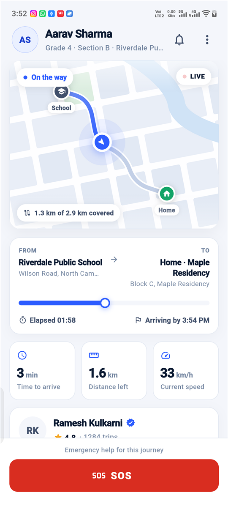
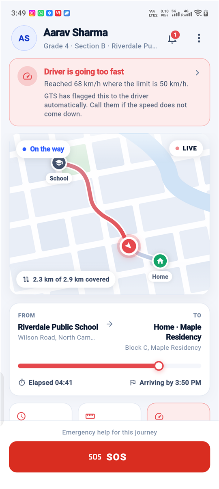
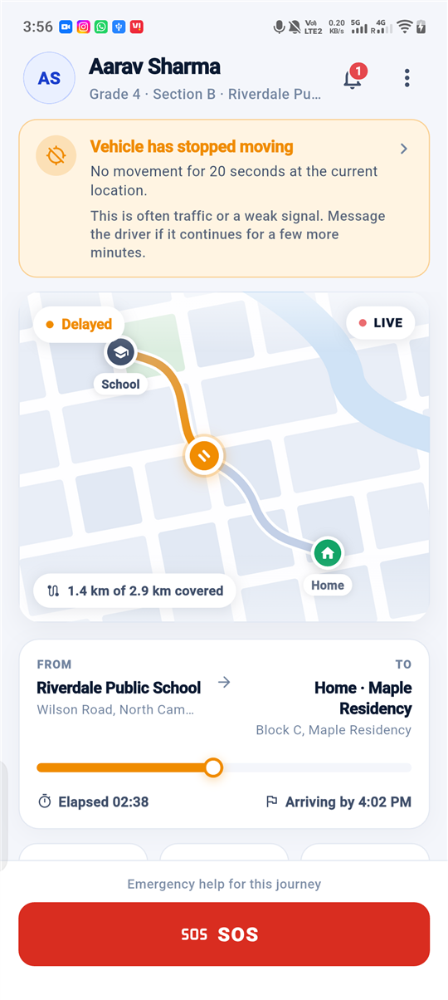
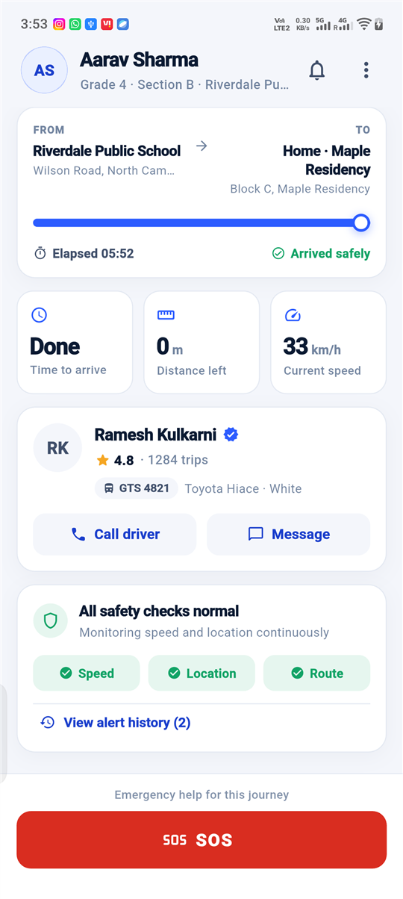
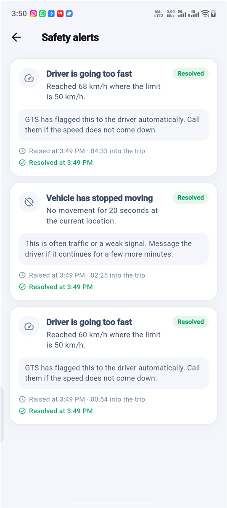
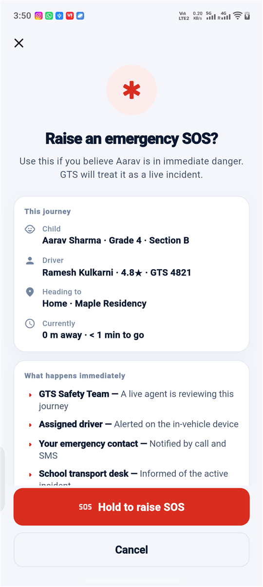
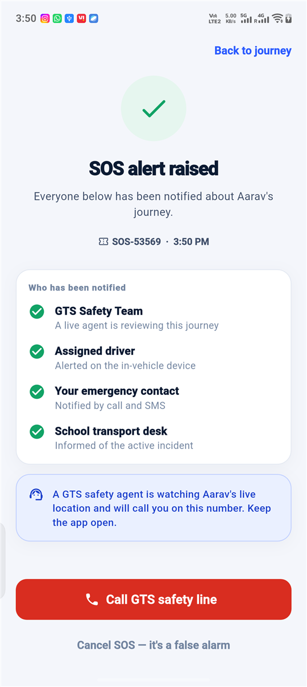

# GTS (Go To Shore) — Parent Trip Tracking

A Flutter prototype of the parent-facing side of GTS: a child is travelling home
from school with a GTS driver, and the parent can see the journey at a glance,
watch the driver move, receive safety alerts, and raise an SOS.

Built as a focused, single-flow prototype rather than a slice of the whole GTS
product. Everything runs on mock data — no backend, no API keys, no auth.

---

## Screenshots

Captured from the release build on a physical Android device (1080×2408).

| Active journey | Overspeeding alert | Location stopped |
|:---:|:---:|:---:|
|  |  |  |
| Live map, ETA, distance and speed, updating as the driver moves | Alert names the measurement; map, trail, progress and speed tile all turn red | Status becomes **Delayed**, marker switches to a paused state |

| Driver & safety checks | Alert history | SOS confirmation | SOS raised |
|:---:|:---:|:---:|:---:|
|  |  |  |  |
| Driver rating, vehicle, one-tap contact, and a named all-clear | Resolved alerts are kept, with trip offsets | Recaps the journey, then **press and hold** to confirm | Reference number and each channel acknowledged individually |

---

## Running it

```bash
flutter pub get
flutter run
```

That's the whole setup. There is no `.env`, no Google Maps key, no Firebase
config, and no network access required — the app runs offline on a fresh clone.

**Requirements:** Flutter 3.41+ / Dart 3.11+ (developed on Flutter 3.41.0).

```bash
flutter analyze   # no issues
flutter test      # 34 tests
flutter build apk --release
```

A prebuilt APK is at `build/app/outputs/flutter-apk/app-release.apk` after
building, and is attached to the submission.

---

## What's implemented

### A. Active trip screen
Child's name, driver's name and rating, school and destination, trip status,
ETA, live speed, distance remaining, the driver's position on a map, and a
persistent SOS button.

The header and the safety banner sit **outside** the scroll view and the SOS
button is docked to the bottom. That's deliberate: an alert you can scroll past
is an alert that gets missed, and the button a parent reaches for in a panic
should never require a scroll to find.

### B. Simulated live location
A scripted speed profile (a short table of keyframes in `mock_trip_data.dart`)
is integrated into *meters travelled*, which is then resolved against a real
2.9 km route polyline using haversine maths.

Working in distance rather than hopping between waypoints is what makes the
movement continuous, and it means speed, distance, ETA and position are
consistent with each other by construction rather than by three separate
counters that can drift apart.

The simulator runs at **4× real time** (a 250 ms tick advances one simulated
second), so the full ~5.8-minute journey plays out in about 90 seconds — long
enough to narrate, short enough for a 2–3 minute demo.

Updated live as the trip progresses: position, heading, speed, distance
remaining, ETA, arrival clock time, progress bar, and trip status.

### C. Safety alerts
Two scenarios, both raised and cleared automatically:

| Scenario | Fires when | Clears when |
|---|---|---|
| **Overspeeding** | Speed exceeds 50 km/h for 4+ seconds | Speed stays below 45 km/h for 6+ seconds |
| **Location stopped** | Vehicle moves under 8 m across a 20-second window | Movement resumes |

The gap between the 50 km/h trigger and the 45 km/h clear is deliberate
hysteresis. Without it, a driver hovering at exactly 50 flaps the alert on and
off every tick — which is precisely how parents learn to ignore alerts.

Alerts are written in plain language ("Driver is going too fast"), carry the
measurement that triggered them, and say what the parent can actually do. They
also drive the whole screen's accent colour, the map marker, and the speed tile,
so the safety state is legible from any part of the screen.

Resolved alerts are kept in a history rather than deleted — "it happened and
then it stopped" is the question a parent asks afterwards.

### D. SOS flow
Tap SOS → a full-screen confirmation that recaps the journey and lists exactly
who will be contacted → **press and hold** to confirm → a success state with a
quotable reference number and each channel acknowledging in turn.

The dedicated screen stops an accidental tap from the trip screen; the hold
stops an accidental tap on the confirmation screen itself. Releasing early
rewinds it, so the gesture is reversible right up until it completes.

Acknowledging the four channels one at a time — rather than flashing "Sent!" —
turns an unverifiable claim into visible progress a frightened parent can read.

---

## Demo timeline

Launch the app and it runs itself. Measured from app start:

| Time | What happens |
|---|---|
| 0:00 | Journey opens at the school gate — status **Picked up**, 0 m covered |
| 0:02 | Vehicle pulls away; marker moves, ETA / distance / speed start updating |
| **0:14** | Speed passes 50 km/h → **overspeeding alert**, screen accent turns red, speed tile goes red |
| 0:21 | Speed drops back → alert resolves, "Speed is back within the limit" |
| **0:36** | Vehicle stops → **location-stopped alert**, status changes to **Delayed** |
| 0:44 | Movement resumes → alert resolves |
| 1:20 | Status changes to **Arriving soon** inside the geofence |
| 1:28 | **Dropped off** — arrival confirmation |

That's a complete run in about 90 seconds, leaving room in a 2–3 minute
recording to demonstrate the SOS flow and the alert history.

**Demo controls** — the ⋮ menu in the header forces either safety scenario on
demand, plus pause/resume and restart, so a live walkthrough doesn't have to
wait for the schedule.

---

## Architecture

Feature-first, with each feature split into `domain` / `data` / `application` /
`presentation`:

```
lib/
├── app/                        # app root + go_router configuration
├── core/                       # cross-feature: theme, geo maths, formatters, shared widgets
│   ├── geo/                    # GeoPoint, haversine, RoutePath (cumulative distances)
│   ├── theme/                  # colour roles, Material 3 theme, spacing scale
│   ├── utils/                  # display formatters
│   └── widgets/                # GtsCard, GtsPill, HoldToConfirmButton
└── features/
    ├── trip/
    │   ├── domain/             # Child, Driver, TripPlace, TripSnapshot, TripStatus
    │   ├── data/               # mock data + TripSimulator
    │   ├── application/        # TripController (Riverpod Notifier), TripState, providers
    │   └── presentation/       # ActiveTripScreen + widgets (incl. the map painter)
    ├── safety/                 # SafetyAlert, SafetyMonitor, banner, status card, history
    └── sos/                    # SosState, SosController, confirm + raised screens
```

**State management — Riverpod 3.** `TripController` is a `Notifier<TripState>`.
It is the only class that knows about wall-clock time: it drives the simulator on
a timer, feeds each snapshot to the safety monitor, and publishes the combined
result. `NotifierProvider` is keep-alive by default in v3, so the simulation
survives navigation into the SOS flow and back.

`ref.watch(...select(...))` is used where a widget needs one field but not the
4×-per-second churn — the header's alert badge and the SOS bar rebuild only when
their own data changes, not on every tick.

**Routing — go_router.** The SOS steps are real routes, not dialogs. They get
their own back-stack entries and full-screen presentation, which is the right
weight for an emergency action and keeps `confirm → raised` explicit instead of
buried in one widget's local state.

**Separation that made the tests possible.** `TripSimulator` and `SafetyMonitor`
are plain Dart with no timers and no Flutter imports. The simulator exposes
`advance(seconds)`; the monitor consumes snapshots and returns alerts. A full
journey — including both safety scenarios and the hysteresis behaviour — replays
instantly in a unit test with no waiting.

### Why a hand-drawn map instead of Google Maps

The brief allows a "convincing map-like visualisation", and a `CustomPainter`
was the better engineering call here:

- No API key, no billing account, no network — the app runs offline on a fresh
  clone, which matters when a reviewer has 10 minutes.
- No platform view, so it renders identically on Android, iOS, web and desktop,
  and it works in widget tests.
- The marker, the travelled trail and the safety colouring all read from the same
  trip state — there's no map SDK to keep in sync.

The projection is equirectangular with a `cos(latitude)` correction, so the route
keeps its real shape. The street grid is drawn as inset blocks on a light
background — the *gaps* between them read as roads, which is much cheaper than
drawing roads and buildings separately.

---

## Tests

34 tests, `flutter test`:

- **`route_path_test.dart`** — haversine distance and bearing against known
  values, cumulative distances, endpoint clamping, travelled-polyline growth.
- **`trip_simulator_test.dart`** — the journey completes and arrives, distance is
  monotonic, the vehicle reads as stopped once it has arrived, the scripted
  profile really does breach the limit and really does stop, ETA stays finite
  while the vehicle is stationary, both demo overrides, and reset.
- **`safety_monitor_test.dart`** — each rule's fire and clear conditions, the
  hysteresis band (48 km/h must neither re-fire nor resolve), severity ranking
  for the banner slot, and that a parked vehicle *after drop-off* is not an
  incident.
- **`active_trip_screen_test.dart`** — renders the child, driver, school and
  destination; the journey visibly advances; an overspeeding alert reaches the
  parent as a banner; a plain tap on the SOS confirm button does nothing while a
  sustained hold dispatches and reaches the success state.

The widget tests run at a real phone viewport (390×844). The default 800×600 test
surface is shorter than any device this ships to, and it was hiding two genuine
layout bugs — an infinite-height constraint in the metrics row that crashed the
screen on launch, and two rows that overflowed at real phone width. Both are
fixed.

A fourth bug only showed up when I screenshotted the release build on a physical
device: the speed tile froze at the last cruising speed after arrival, so the
screen read "Arrived safely" beside a live 33 km/h. Fixed, with a regression
test — a safety product cannot contradict itself.

---

## AI tools used

**Claude (Claude Code in VS Code)** for essentially all of it, used as a pair
rather than a code vending machine:

- Talked through the architecture first — feature-first layout, where the
  simulator/monitor boundary should sit, and *why* the timer belongs in the
  controller rather than in either service. That decision is what made the logic
  unit-testable, and it came out of the discussion, not from a prompt asking for
  code.
- Generated the bulk of the implementation from a spec I refined as we went
  (safety thresholds, hysteresis, the ETA clamp while stopped, the 4× time scale).
- Wrote the `CustomPainter` map, which I iterated on for the projection maths and
  the street-grid approach.
- Used the test suite as the review loop. The tests caught three real bugs that a
  visual check would have missed: `CrossAxisAlignment.stretch` forcing an infinite
  height inside the `ListView` (a crash on launch), and two `RenderFlex` overflows
  that only appear at true phone width.
- Ran the release build on a physical device and read the screenshots critically,
  which is what caught the fourth bug — the frozen speed reading after arrival.
  Worth saying plainly: the tests and the device pass caught things I would
  otherwise have shipped, and neither was a substitute for the other.

I understand every part of this and can walk through any of it — the haversine
projection, why the hysteresis band exists, why `NotifierProvider` doesn't need
`keepAlive` in Riverpod 3, or why the simulator integrates speed instead of
stepping through waypoints.

---

## What I'd do with another 1–2 days

**Correctness and robustness**
- Replace `TripSimulator` with a `TripRepository` interface and two
  implementations — the mock one and a real WebSocket/location feed. The
  consumers wouldn't change; that's the point of the current boundary.
- Handle a genuinely *stale* feed as distinct from a stopped vehicle. Right now
  "not moving" covers both; a real product must tell "stuck in traffic" apart
  from "we lost the device", because the parent's response is different.
- Persist alert history and SOS state so a backgrounded or killed app doesn't
  lose an active incident.

**Product**
- A trip timeline (picked up → checkpoints → dropped off) with per-stop times,
  which is what parents actually screenshot and share.
- Geofence notifications ("2 minutes away") via local notifications, so the
  parent doesn't need the app open.
- Multi-child support — the household case is two kids on different routes, and
  it changes the information architecture more than it first appears.
- Let the parent acknowledge or dismiss an alert, and feed that back as a signal
  on the driver.

**Engineering**
- Golden tests for the map painter and the alert states; they're the pieces most
  likely to regress silently.
- Dark mode. The colour system is already role-based (`safe`/`warning`/`danger`
  rather than raw hues), so it's a token swap rather than a rewrite — I left it
  out to spend the time on getting one palette genuinely right.
- Accessibility pass: semantic labels on the map marker and the metric tiles, and
  verification that the safety states are distinguishable without relying on
  colour alone.
- Localisation — all copy is currently inline English.

**On the simulation itself**
- The speed profile is a hand-tuned script. A small state machine (traffic light,
  congestion, open road) would generate more varied journeys and exercise the
  safety rules against cases I didn't think to script.
